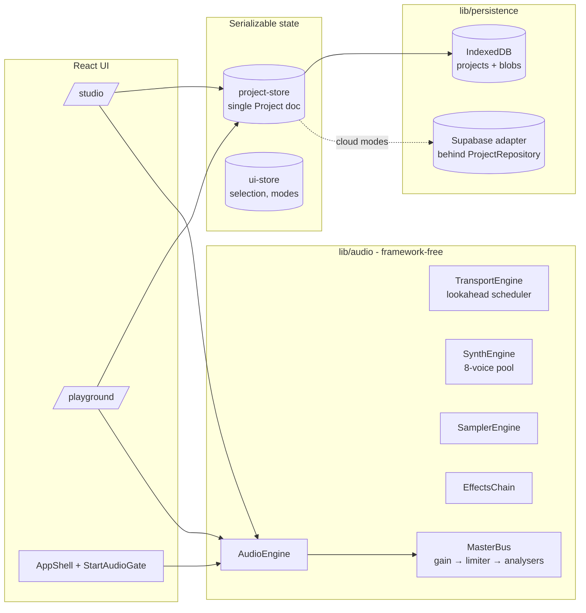

# Architecture - 0wave Studio

## Overview



## Boundaries

| Layer | May import | May NOT import |
|---|---|---|
| `lib/schema` | zod | React, Web Audio, stores |
| `lib/music` | nothing | everything above |
| `lib/audio` | `lib/schema`, `lib/music` | React, zustand, Next |
| `lib/state` | `lib/schema` | Web Audio, persistence impls |
| `lib/persistence` | `lib/schema` | React |
| `components/*` | everything | - |

## Two creative sections

`/studio` and `/playground` are the only creative destinations. They share one `AppShell` (top bar + Start Audio gate), one project store, one audio engine singleton. Route changes are client-side navigations: the AudioContext, transport state, sounds, patterns and clips all survive.

**Studio** owns sound creation: Synth, Record, Import, Sample Editor, Sound Library (internal modes, not main sections). **Playground** owns composition: transport, tracks, timeline, Pattern Editor, Piano Roll, Clip Editor, essential mixer.

## Shared sound model

`SoundDefinition` is either a `SynthSound` (full `SynthState` patch) or a `SampleSound` (asset reference + non-destructive edit parameters). Tracks hold `soundId` references only (ADR-005 live-update strategy).

## Audio graph

```
SynthVoice ×8 ─┐
SamplerEngine ─┼→ TrackBus (gain/pan/mute/solo → per-track FX) ─┐
AudioTrackEngine ┘                                                ├→ MasterBus → DynamicsCompressor (limiter) → destination
Studio preview bus ───────────────────────────────────────────────┘        └→ AnalyserNode ×2 (scope + spectrum)
```

Parameter changes go through `AudioParam` with short ramps (5-20 ms) to avoid zipper noise and clicks. Scheduling is lookahead-based on the audio clock (ADR-002). `stop()` cancels every scheduled event and silences active notes.

## State and persistence

The `Project` document (schema v1, zod-validated) is the only persisted creative state. Autosave debounces to IndexedDB; blobs live in a separate object store. Schema migrations run before validation on every load. Supabase sync is a `ProjectRepository` implementation selected by access mode (see `docs/DEPLOYMENT.md`).

## SSR safety

No Web Audio, IndexedDB or `window` access at module top level anywhere. The engine loads via dynamic `import()` behind `getAudioEngine()`; both creative routes are client boundaries under server-rendered page shells.
